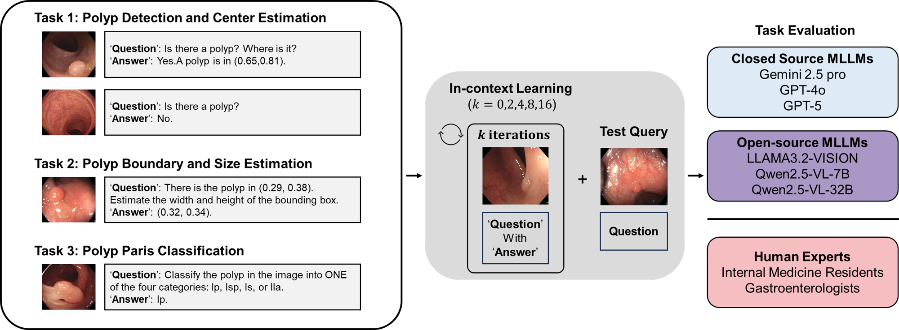

# EvalMLLM4Polyp
Official code for "Evaluating Multimodal Large Language Models for Multi-Task Colonoscopic Polyp Analysis Using In-Context Learning"



## Introduction

This repository contains the inference scripts for evaluating multimodal large language models (e.g., GPT-4o, GPT-5, Gemini-2.5) on comprehensive colonoscopic polyp analysis. Each script is configured with task-specific instructions, and the models are provided with in-context learning samples directly in the prompt.

## Installation

1.  **Clone the repository and instal dependencies:**
    ```bash
    git clone [https://github.com/your-username/your-repository-name.git](https://github.com/your-username/your-repository-name.git)
    cd your-repository-name

    # Install required libraries  
    pip install -r requirements.txt
    ```
2.  **Set up API Keys:**
    Create a `.env` file in the root of the project directory and add your API keys:
    ```
    OPENAI_API_KEY="your_openai_api_key_here"
    GOOGLE_API_KEY="your_google_api_key_here"
    ```

## Data Preparation

Please organize the few-shot examples and test set data into the following directory structure:

```
./data/
├── few_shot_examples/
│   ├── positive/
│   │   ├── images/
│   │   │   ├── image1.png
│   │   │   └── ...
│   │   └── annotations/
│   │       ├── image1.xml
│   │       └── ...
│   └── negative/
│       └── images/
│           ├── neg-image1.png
│           └── ...
└── test_set/
    ├── positive/
    │   ├── images/
    │   └── annotations/
    └── negative/
        └── images/
```

## Future Updates

Scripts for the open-source models (e.g., LLaMA, Qwen) and the full evaluation and plotting code will be released in a future update.

## License

This project is licensed under the MIT License. See the [LICENSE](LICENSE) file for details.
